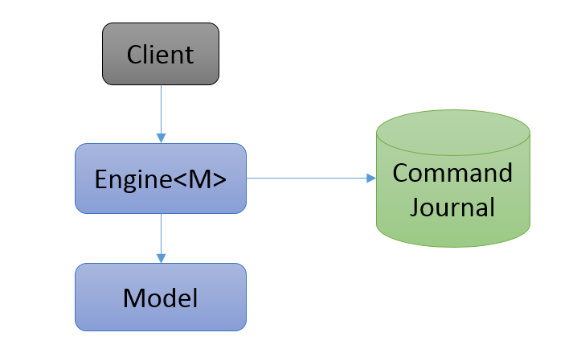

## What is OrigoDB?
OrigoDB is an in-memory database toolkit. The core component is the `Engine`. The engine is 100% ACID,
runs in-process and hosts a user defined data model. The data model can be domain specific or
generic and is defined using plain old NET types. Persistence is based on snapshots and write-ahead
command logging to the underlying storage. 

### The Model
* is an instance of the user defined data model
* lives in RAM only
* _is_ the data
* is a projection of the entire sequence of commands applied to the initial model, usually empty.
* can only be accessed through the engine

### The Client
* interacts with the Engine by passing query and command objects
* has no direct reference to the model

### The Engine
The Engine encapsulates an instance of the model and is responsible for atomicity, consistency, isolation and durability.
It performs the following tasks:
* writes commands to the journal
* executes commands and queries
* reads and writes snapshots
* restores the model on startup

### We call it a toolkit because you have a lot of options
* Modelling - define your own model or use an existing one. Generic or domain specific. It's up to you.
* Storage - Default is FileStore. SqlStore or write your own module.
* Data format - Choose wire and storage format by plugging in different IFormatter implementations. Binary, JSON, ProtoBuf, etc
Read more in the docs on [Extensibility](/docs/extensibility)

### Design goals
Our initial design goals were focused on rapid development, testability, simplicity, correctness,
modularity, flexibility and extensibility. Performance was never a goal but running in-memory with
memory optimized data structures outperforms any disk oriented system. But of course a lot of optimization is possible.

